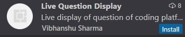
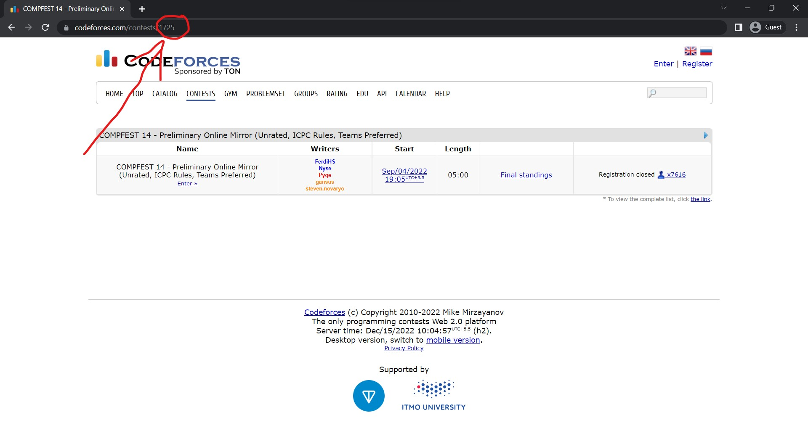

<h1>Live question display (Cf question extrator) </h1>
<h2>Need of project :</h2>

When competitive coders participates in the contest conducted by codeforces , they need to switch between the code editor and the codeforces website to read the question . They takes much time .  In this case , their is a need of such a vs code extension , which displays the questions in the editor itself .

 
<h2>Installing and running the project : </h2>

First of all , user need to download the extension from the vs code market place by searching vs code extension . 

After installing the extension , the extension ion will be shown in the leftmost sidebar , as a question icon . After clicking on that , user will be asked the contest id . User can get contest ID from the contest url as follows : 

After pasting the contest id , extension will take few seconds to fetch question and will display the same in the primary sidebar . User can navigate the questions through the next/previous buttons provided .

<h3>Video Tutorial : <a href="https://drive.google.com/file/d/1e_yMnwlMm7ppqfohYR64lGn48y-uNkWG/view?usp=sharing">drive link</a></h3>
 
<h2>Common issues faced : </h2>
<h3>If the questions aren't showing in the sidebar :</h3>
<ul>
    <li>Try reopening the extension (clicking the extension icon twice ) and again putting the contest id .</li>
    <li>Check if the codeforces website is working properly .</li>
    <li>If the issues continues , try reloading the vs code (ctrl + shift + P , then reload window ) .</li>
</ul>
 
<h2>Tech stack used :</h2>
1. Svelte :
As the webview of vs code is a single page webview , Svelte framework is used in it. Svelte is better at small webviews because of it's better code optimisation .

2. Web - Scraping  :
____________________________________-

3.  Typescript , HTML , CSS , NodeJS :
 
 
<h2>Team members :</h2>

1. Vibhanshu Sharma &nbsp;&nbsp;&nbsp;<a href="https://github.com/vibhanshushrm2025">GitHub</a>&nbsp;&nbsp;&nbsp; <a href="https://www.linkedin.com/in/vibhanshu-sharma-733882229/">LinkedIn</a>

2. Digvijay Anand &nbsp;&nbsp;&nbsp;&nbsp;&nbsp;&nbsp;&nbsp;&nbsp;&nbsp;<a href="https://github.com/digvijayyanand">GitHub</a> &nbsp;&nbsp;&nbsp;<a href="https://www.linkedin.com/in/digvijay-anand-8b75bb224/">LinkedIn</a>

